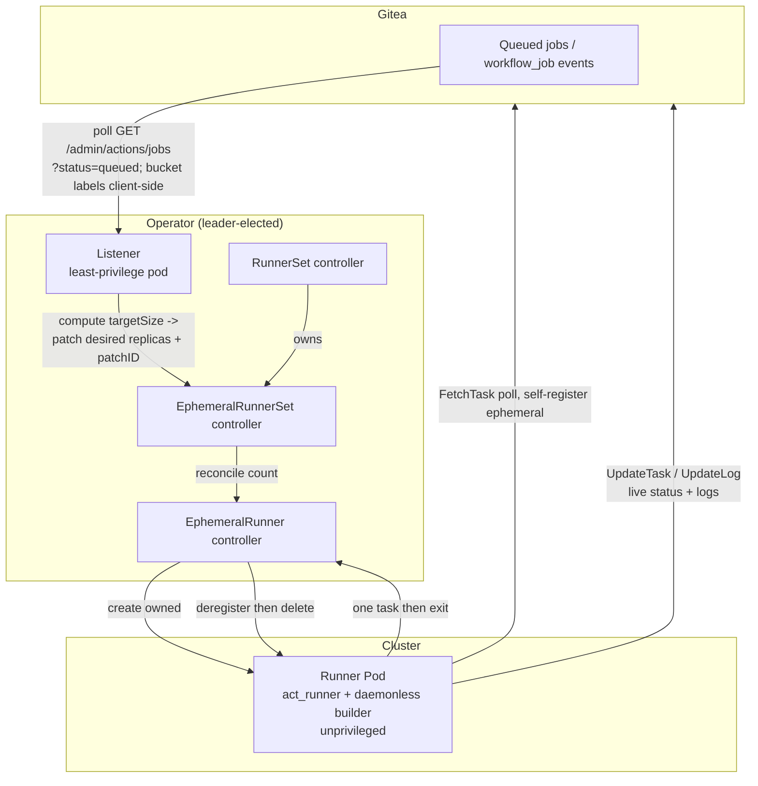
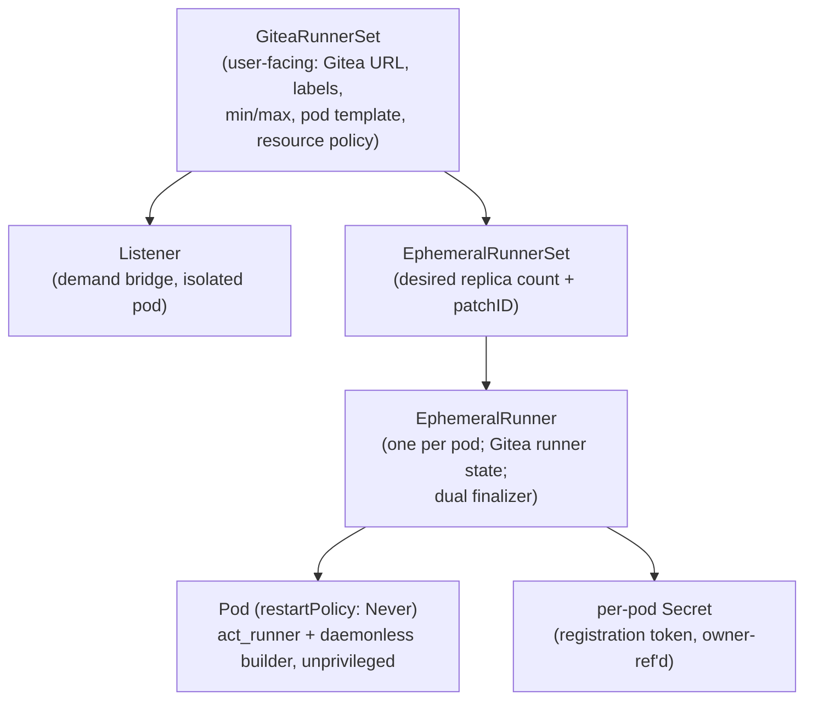

# Gitea Actions Kubernetes Operator -- Product/Design Spec

Status: Draft for arch review (rev. 2026-06-30 -- Autopilot + daemonless pivot;
demand-bridge live-probe validated)
Owner: product-manager
Related: `DECISIONS.md` (decision log), `../../adr/` (ADRs), bd epic `garc` (work items)

Revision note (2026-06-30): v1 dropped privileged DinD in favor of unprivileged
daemonless image builds, making **GKE Autopilot the v1 target** (was GKE Standard).
`services:` containers and raw `docker` CLI are now out of v1 scope. The demand-bridge
spike (garc-7ft.1) was validated against live Gitea 1.26.1 and is closed; the demand
query is `?status=queued` (not `waiting`) with client-side label bucketing. See
DECISIONS.md D2/D3 and bd memory for the probe details.

---

## 1. Problem statement

Teams running Gitea Actions for CI need somewhere to execute jobs. The options today
are unsatisfying:

- A **statically-provisioned act_runner** (a long-lived VM or pod) is always on,
  shares state between jobs (a leaked file or process from job A can affect job B),
  must be patched and capacity-planned by hand, and either sits idle (wasting money)
  or becomes a bottleneck under burst.
- **Gitea Enterprise's Actions Runner Controller** exists but is Enterprise-only
  (Gitea > 23.8.0), runs DinD-per-pod without true one-job-per-pod isolation, and
  offers no portability or build-cache story (see Related work, sec. 12).

We want **ephemeral, isolated, on-demand** CI capacity on Kubernetes: every job runs
in a **fresh pod that executes exactly one job and is then torn down**, so there is
no cross-job contamination, no idle waste, and no manual capacity management. The
initial deployment target is **GKE Autopilot** (no privileged containers; image
builds run through a daemonless builder, sec. 7), and the operator must be **portable
to any conformant Kubernetes distribution**.

This is the same shape GitHub's actions-runner-controller (ARC) solves for GitHub
Actions. We are building the Gitea/act_runner equivalent, adapted to Gitea's
materially different runner API (see sec. 4).

### The ubiquitous language

We use the domain's exact terms, consistently, in spec, issues, and code:

| Term | Meaning (Gitea's model) |
|---|---|
| **Workflow run** (`ActionRun`) | One triggered execution of a workflow file. |
| **Job** (`ActionRunJob`) | One `jobs:` entry in a workflow; has `runs-on` labels and `needs:`. |
| **Task** (`ActionTask`) | The concrete unit a single runner picks up and executes (one task per job attempt). The unit of execution. |
| **Runner** | A registered act_runner identity in Gitea (has labels, a uuid, a token). |
| **Ephemeral runner** | A runner registered with `--ephemeral`: accepts exactly one task, runs it, exits; Gitea auto-removes its row on completion. |
| **Registration token** | Reusable Gitea-issued token used to register a runner (instance/org/repo scoped). NOT single-use. |
| **Runner token** | The per-runner credential issued at registration, stored in `.runner`, authenticating that runner's RPCs. |
| **Label** | A string (`ubuntu-latest`, `dind`, `self-hosted`) a runner advertises; a job's `runs-on` must be a subset of a runner's labels to match. |
| **Runner pod** | The Kubernetes Pod we create that runs one ephemeral act_runner (unprivileged; daemonless builder for image builds). |
| **Operator / controller** | Our Kubernetes controller that provisions and tears down runner pods. |
| **Listener** | A separate, least-privilege component that bridges Gitea's job demand into a desired runner count. |
| **Daemonless builder** | An unprivileged image-build tool (BuildKit-rootless / Buildah / Kimia / Kaniko-fork) used in place of `docker build`; no Docker daemon, no privileged pod (sec. 7). |

A note on "watch the queue": Gitea does **not** push job events to an operator. So
"the operator watches for new jobs" is realized as **demand-driven scaling of
ephemeral runners**, derived from polling the admin jobs queue for jobs in the
`queued` state (sec. 4 -- the live-probe-confirmed mechanism).

---

## 2. Personas

**Priya -- Platform Engineer (primary).** Owns the Kubernetes cluster and the CI
platform. Wants to install the operator once (Helm), point it at a Gitea instance,
set min/max runner bounds and per-team resource policy, and never hand-manage runners
again. Cares about cost, isolation/security, observability, and not getting paged
when a node dies mid-job.

**Sam -- Developer (job author).** Writes workflows that build and push Docker images.
Wants jobs to start quickly, build caches to not be cold every time, and accurate live
status in the Gitea UI. Does not want to know the operator exists. (v1 supports
`docker build`/push via a daemonless builder; `services:` containers and raw `docker`
CLI are out of v1 scope -- see sec. 7.)

**Dana -- Security/Compliance.** Needs assurance that secrets do not outlive a job,
that one job cannot snoop on another, and that credentials are scoped and rotated. v1
runs **no privileged containers** (no DinD), which materially shrinks the posture she
has to sign off on.

---

## 3. Goals and non-goals

### v1 goals
1. One ephemeral runner pod per job; fresh isolation; automatic teardown.
2. Demand-driven scaling between `minRunners` and `maxRunners`.
3. **Unprivileged image builds** via a daemonless builder so `docker build`/push work
   on GKE Autopilot with no privileged container (sec. 7).
4. A **build-cache** mechanism so image builds are not cold every job (sec. 8).
5. Live job status reflected in Gitea throughout the lifecycle, not just at the end.
6. Guaranteed teardown and no orphaned Gitea runner registrations, even across
   operator restart or a pod dying mid-job.
7. Per-pod, short-lived credentials that are destroyed on teardown.
8. Configurable resource requests/limits, with policy resolvable per repo / org /
   global.
9. Portability: only GA core Kubernetes APIs + CRDs; no cloud-provider coupling; runs
   on GKE Autopilot with a restricted securityContext.
10. HA operator (leader election) and graceful shutdown.

### Non-goals (v1)
- **`services:` containers and raw `docker` CLI in steps** -- both need a Docker
  daemon, which v1 deliberately does not run (sec. 7). Revisit if/when upstream
  native-K8s execution (PR #1000) lands.
- Native Kubernetes step-execution (pod-per-step) -- act_runner does not support it
  (sec. 4); track upstream PR #1000.
- DinD / any privileged container -- explicitly excluded so the operator admits on
  Autopilot (sec. 7, 9).
- macOS/Windows runners.
- Multi-Gitea-instance fan-in from one operator (one operator targets one Gitea).
- Multi-tenant / public-facing Gitea hosting -- the admin-token demand poll suits a
  single internal instance (sec. 4 caveat).

---

## 4. Constraint that shapes everything: Gitea is pull-based

This is the single most important fact in the design, and it is where we diverge from
ARC.

- act_runner **polls** Gitea for work via ConnectRPC `FetchTask` (~every 2s) over
  `/api/actions/...`, authenticated by `x-runner-uuid` / `x-runner-token`. Gitea
  never connects to the runner. There is **no push, no webhook to the runner, no
  long-poll an operator can subscribe to** for "a job is available."
- ARC's whole control loop relies on a GitHub "jobs available" long-poll that returns
  a count. **Gitea has no equivalent endpoint.**
- Gitea's queue visibility is **scope-dependent**. The **public/repo-scoped**
  endpoints (`/repos/.../actions/tasks`) **omit WAITING tasks** (gitea issue #35134)
  and have access-scoping gaps (#36268). **But the admin endpoint
  `GET /api/v1/admin/actions/jobs` exposes the full queue** with a `status` filter.
  So an operator holding an **admin-scoped token can poll the queue directly** -- the
  same approach Gitea Enterprise ARC, `rustunit/gitea-ci-autoscaler`, and the KEDA
  path use. Caveat (maintainer `lunny`, #32862): an admin-token design suits a single
  internal instance, not multi-tenant public hosting.
- **LIVE-PROBE FINDINGS (Gitea 1.26.1, 2026-06-30) -- these correct earlier
  assumptions:**
  - A job awaiting a runner has **`status: queued`**, NOT `waiting`. The demand query
    is **`?status=queued`**; `?status=waiting` returns 0 on this version. Valid enum:
    `queued, waiting, pending, in_progress, success, failure, cancelled, skipped,
    completed`; **invalid (HTTP 400): `running`, `blocked`, `unknown`.**
  - The **`labels` query filter is a server-side no-op** -- it returns all jobs
    regardless of value. **Label filtering must be done client-side** in the listener,
    bucketing per pool. (`labels[]` IS populated on a queued job, so this is viable.)
  - Queue depth comes free from the **`X-Total-Count`** response header (plus RFC-5988
    `Link`); pagination is via `limit`+`page` (`per_page` alone is ignored).
  - Unclaimed-job sentinels: **`runner_id: 0`** and **`started_at: 1970-01-01`**.
  - Runners are listed at **`/api/v1/admin/actions/runners`** (not `/admin/runners`).
    Runner labels are objects `{id,name,type}`; job labels are bare strings -- the
    operator must normalize. Runner `version` may be `null` -- do not depend on it.
- act_runner has **only Docker and host execution backends**; no native Kubernetes
  mode (spike-confirmed; native-K8s is only WIP PR #1000, unmerged). v1 avoids the
  Docker backend's privileged DinD entirely by **not running service containers** and
  routing image builds through an **unprivileged daemonless builder** (sec. 7).
- An **ephemeral** runner -- registered with **`act_runner register --ephemeral`**
  (a registration-time flag; **live-validated**) -- accepts exactly one task, runs it,
  and the daemon **self-exits**; Gitea **auto-deletes the runner row** server-side on
  graceful completion (`CleanupEphemeralRunners`, PR #33570 -- confirmed firing).
  Requires act_runner >= 0.2.12 and Gitea >= 1.24 (target: **0.2.13 + 1.26.1**,
  confirmed). **Corrected assumptions (live probe + upstream-source verification,
  2026-06-30):** the env var **`GITEA_RUNNER_EPHEMERAL=1` DOES exist** in the standard
  `gitea/act_runner` image -- the image entrypoint (`run.sh`) maps it to `register
  --ephemeral` (verified against upstream source). The operator may use either the
  `--ephemeral` flag directly or the env var via the entrypoint. `daemon --once`
  (mapped from `GITEA_RUNNER_ONCE`) is a weaker "run one job then exit" that does NOT
  mark the runner ephemeral server-side -- only `--ephemeral`/`GITEA_RUNNER_EPHEMERAL=1`
  produces a row with `ephemeral: true` and the self-exit + auto-delete behavior. (Our
  initial probe missed the env var by invoking `register`/`daemon` directly, bypassing
  the entrypoint that consumes it.) There is **no `unregister` command**; deleting
  `.runner` does not deregister (the row lives in Gitea's DB). **On crash (SIGKILL
  mid-job): the row is orphaned `online`/`ephemeral:true` and the task stays stuck
  `in_progress` until Gitea's server-side zombie-task reaper clears it** -- the relevant
  timer is `[actions] ZOMBIE_TASK_TIMEOUT` (default ~10 min, source
  `modules/setting/actions.go`), NOT the workflow/runner timeouts (those are enforced by
  the live runner, which is gone). This is exactly what the dual finalizer + reconcile
  sweep (sec. 6.4) must handle.

**Design consequence.** An **admin-scoped operator observes queued work** by polling
`GET /api/v1/admin/actions/jobs?status=queued` and **filtering labels client-side**
(the server `labels` filter is a no-op -- live-probe confirmed). So v1 derives demand
by **polling the admin jobs queue**, bucketing the `queued` jobs by their `labels[]`
into per-pool desired counts, with a configurable **warm-pool floor** (`minRunners`)
as an optimization to cut job-start latency rather than a necessity. Each runner is
still ephemeral (self-pulls one job, then exits), preserving the isolation guarantee;
the provisioning *trigger* is the queue poll + floor, not a per-job push (which Gitea
cannot give us). **The demand-observability spike (garc-7ft.1) is CLOSED -- mechanism
validated against live Gitea 1.26.1; poll interval remains a design knob in the
scaling slice (garc-7ft.8).**

---

## 5. Architecture

We mirror ARC's proven CRD hierarchy and its load-bearing safety patterns, and we
replace ARC's GitHub-listener with a Gitea-appropriate demand bridge.

### 5.1 Control loop

**The demand bridge (v1 mechanism; live-probe validated).** The listener derives
demand by **polling Gitea's admin jobs queue** -- the convergent design across all
three known Gitea autoscalers, now confirmed end-to-end against Gitea 1.26.1:
- **Primary: poll `GET /api/v1/admin/actions/jobs?status=queued`**, then **bucket the
  returned jobs by their `labels[]` client-side** (the server `labels` filter is a
  no-op). For each GiteaRunnerSet, the desired count is computed from the queued jobs
  whose labels match that set. The operator writes that count to `status.targetSize`
  (+ `targetSizeUpdatedAt`) -- borrowed from Gitea Enterprise ARC's CRD -- then patches
  `EphemeralRunnerSet` replicas to match.
- **Fast path:** `X-Total-Count` gives the total queued depth in one header (no page
  walk) -- useful as a cheap "is anything queued at all?" gate before fetching+bucketing
  job objects for the per-pool breakdown.
- **Floor: warm pool** -- keep `minRunners` ephemeral runners always polling so the
  common case is "a runner is already waiting when a job appears," cutting cold-start
  latency. An optimization on top of the poll, not a substitute for it.
- **Bounds:** desired count clamped to `[minRunners, maxRunners]`; `patchID`
  coordinates listener vs controller to avoid scale-down races (an ARC lesson).

**Spike garc-7ft.1 is CLOSED** -- the mechanism, status enum (`queued`, not
`waiting`), client-side label bucketing, pagination, and queue-depth header are all
validated on the live target (Gitea 1.26.1, 2026-06-30). Poll interval remains a
design knob in the scaling slice (garc-7ft.8). A `lunny`-flagged caveat (#32862):
admin-token polling suits a single internal Gitea, not multi-tenant public hosting --
documented as a scope limitation (now a stated v1 non-goal).

### 5.2 Resource hierarchy (CRDs)

Modeled on ARC; CRD-per-runner (not bare Pods) so we have a first-class object to
carry Gitea-side state, finalizers, status, and owner-ref GC.

- **GiteaRunnerSet** -- what Priya deploys (one per scale set / label set). Holds
  `giteaConfigUrl`, `giteaConfigSecretRef`, `runnerScope` (instance/org/repo),
  `labels`, `minRunners`, `maxRunners`, `resourcePolicyRef`, and
  `template: corev1.PodTemplateSpec` (full pod customization).
- **EphemeralRunnerSet** -- owns the desired count; the listener patches
  `spec.replicas` + `spec.patchID` (the patchID coordinates listener vs controller to
  avoid scale-down races, an ARC lesson). The computed desired count is also surfaced
  as `status.targetSize` + `targetSizeUpdatedAt` (borrowed from Gitea Enterprise ARC)
  so the scaling decision is observable.
- **EphemeralRunner** -- one per pod; carries Gitea runner id/uuid, status
  (phase/reason, current job ref for status reporting), a `failures` map with backoff,
  and the **dual finalizer**.
- **Pod** -- `restartPolicy: Never` so crashes are controller-driven (preserving
  one-job-per-pod): the act_runner container runs unprivileged with a restricted
  securityContext; image builds use a daemonless builder (sec. 7). No DinD sidecar, no
  Docker socket, no privileged container.

Portability: all of the above uses `apiextensions.k8s.io/v1` CRDs and GA core APIs
only; leader election via `coordination.k8s.io` Leases; no cloud-provider APIs;
default StorageClass; portable node labels only; restricted securityContext so it
admits on GKE Autopilot (sec. 9).

---

## 6. The open design questions, answered

### 6.1 Resource management
- Per-pod **requests** and **limits** come from a resolved **resource policy**.
  Resolution order (most specific wins): **repo -> org -> global default.** Expressed
  as a `ResourcePolicy` config (a CRD or ConfigMap; design choice in ADR) keyed by
  scope, so Priya sets a generous global default and tightens/loosens per org or repo.
- Defaults ship sane (e.g. 2 vCPU / 4Gi for the runner, since image builds are
  memory- and CPU-hungry and there is no separate sidecar to size).
- On clusters where limits are forced equal to requests (a portability concern, and
  **the GKE Autopilot behavior -- the v1 target**), the policy treats request as the
  effective ceiling and the docs warn against over-requesting (cost) and
  under-requesting (OOM/throttle during builds).
- Cost lever: pods bill for lifetime x requests, so right-sizing per scope is the
  main control. A configurable warm-pool floor (`minRunners`) trades idle cost for
  low job-start latency -- Priya's dial.

### 6.2 Timeouts and retries -- slow vs stuck
A job is **slow** if it is making progress; **stuck** if it is not. We distinguish
them by **liveness signals**, not a single wall-clock timeout:
- **Per-job hard cap** -- `activeDeadlineSeconds` on the pod (policy-configurable,
  also resolvable per scope). Exceeding it = failed/`DeadlineExceeded`, pod killed.
  This is the backstop for a truly hung job.
- **Progress/liveness** -- act_runner emits `UpdateLog`/`UpdateTask` ~every 1s while
  working. The operator treats **absence of any task progress for a configurable
  stall window** (e.g. no log/heartbeat advance for N minutes) as *stuck*, distinct
  from a long-but-progressing job that is merely *slow*. A slow-but-progressing job
  is left alone until the hard cap.
- **Retries** -- a pod that fails to *start* or dies *before claiming* a task is
  retried (recreate a fresh EphemeralRunner) with capped exponential backoff
  (ARC-style `failures` map, max ~5). A pod that fails *during* a claimed task is
  **not silently retried** by the operator -- the task result flows back to Gitea, and
  re-running is the user's/Gitea's decision (`rerun`), because re-executing
  partially-run CI is unsafe to do blindly. This boundary is explicit in the spec so
  we do not double-run side-effecting jobs.

### 6.3 Credential management
- The operator authenticates to Gitea with **two distinct scoped credentials** held in
  Kubernetes Secrets (the operator's, not the pod's), used to read the demand queue and
  to obtain **registration tokens** at the configured scope (org/instance).
  **Privilege split (live-confirmed):** the demand listener holds a **read** credential;
  the **teardown/deregister** controller holds a separate **write** credential. There
  are two scoping tiers; **org-scoped is the recommended default** (spike garc-3bk,
  live-confirmed on Gitea 1.26.1):
  - **Recommended -- org-scoped (zero admin scope):** listener uses **`read:organization`**
    (`GET /api/v1/orgs/{org}/actions/jobs?status=queued`); teardown uses
    **`write:organization`** (`DELETE /api/v1/orgs/{org}/actions/runners/{id}` returns
    204 -- no `write:admin`). Registration tokens come from the org
    `registration-token` endpoint under the same scope.
  - **Fallback -- instance/admin-scoped (whole-instance or multi-org):** listener uses
    **`read:admin`** (`GET /admin/actions/jobs`); teardown uses **`write:admin`**
    (`DELETE /admin/actions/runners/{id}` returns 403 without it). `write:admin` is the
    single most powerful Gitea scope; prefer the org tier wherever the deployment is
    org-bounded.

  The least-privilege listener and the higher-privilege teardown controller hold
  different credentials in either tier (see ADR 0006).
- Each runner pod gets a **per-pod Secret** containing a registration token, with an
  **ownerReference to the pod/EphemeralRunner**, injected via `secretKeyRef`/`envFrom`.
  The pod's `act_runner` is launched as **`register --ephemeral`** (equivalently
  `GITEA_RUNNER_EPHEMERAL=1` via the image entrypoint -- both work, live-corrected);
  once it claims its one task, Gitea revokes its polling credential so it cannot fetch
  further work before untrusted job code runs, and the runner self-exits.
- **Teardown:** the per-pod Secret is GC'd with the pod (owner-ref), so the token does
  not outlive the workload. The high-value operator credential never enters a runner
  pod -- only the scoped, short-lived registration token does (the ARC blast-radius
  pattern, adapted: Gitea has no JIT-config API, so we inject a registration token).
- **Rotation:** every pod gets a fresh token; there is nothing long-lived in a pod to
  rotate. The operator's own Gitea credential is rotated out-of-band (external secret
  store / manual), documented for Dana.
- Caveat (confirmed): Gitea registration tokens are **reusable, not single-use**, and
  are **not** API bearer tokens (live probe: a registration token 401s against every
  REST route -- it only authenticates `act_runner register`). So the isolation
  guarantee rests on the **`--ephemeral`** registration + Gitea's
  credential-revocation-on-claim, not on token single-use. **This is now fully
  validated** (garc-7ft.2, CLOSED): register --ephemeral -> one task -> self-exit ->
  Gitea auto-deletes the row. The only residual is the **crash path** -- a SIGKILL'd
  runner leaves an orphaned `online` row + a stuck task, handled by sec. 6.4.

### 6.4 Error recovery and graceful shutdown
- **Pod fails mid-job:** the EphemeralRunner controller observes the terminated
  container; records the failure (backoff map); reports the task result to Gitea; and
  tears the pod down. It does not auto-rerun a claimed task (sec. 6.2).
- **No orphaned Gitea runners:** the **dual finalizer** -- (1) deregister the runner
  from Gitea (org-scoped `DELETE /api/v1/orgs/{org}/actions/runners/{id}` under
  **`write:organization`**, recommended; or the admin route under **`write:admin`**,
  fallback -- live-confirmed; a safety net, since Gitea auto-deletes ephemeral rows on
  *graceful* completion), then (2) delete pod + per-pod Secret. A pod cannot fully
  disappear until Gitea has been told. **Confirmed crash behavior (garc-7ft.2):** a
  SIGKILL'd ephemeral runner leaves its row `online`/`ephemeral:true` orphaned AND its
  task stuck `in_progress` until Gitea's server-side zombie-task reaper clears it
  (`[actions] ZOMBIE_TASK_TIMEOUT`, default ~10 min) -- Gitea does NOT detect the dead
  runner faster than that, and the workflow/runner timeouts do not apply (the live
  runner that would enforce them is gone). **There is no Actions cancel API in 1.26.1
  (spike garc-i5b):** the operator CANNOT actively cancel the stuck task -- deleting the
  runner row leaves the task `in_progress` (pinned to the dead runner_id), and DELETE/
  rerun on the run return 400. So the sweep can only (a) deregister orphaned `online`
  ephemeral rows whose pod is gone (so they stop counting as capacity) and (b) surface
  the stuck task in status/metrics; the task itself waits for the zombie reaper.
  Mitigation guidance: recommend a low instance `ZOMBIE_TASK_TIMEOUT` (the correct lever
  for crash reaping, NOT the workflow `timeout-minutes`). Upstream watch: go-gitea
  PR #35382 adds `POST /actions/runs/{run}/cancel` in milestone 1.28.0 (open, not in
  1.26.1) -- a future active-cancel path. The known hazard (ARC) is `kubectl delete
  --force --grace-period=0` bypassing finalizers -- documented; the periodic reconcile
  sweep is the backstop.
- **Operator restart/upgrade:** control-plane-driven teardown (owner-ref GC,
  `activeDeadlineSeconds`, `ttlSecondsAfterFinished`) survives operator downtime;
  finalizers are cleared when the operator returns. Leader election (Lease) means only
  one replica reconciles; graceful SIGTERM drains in-flight reconciles
  (`GracefulShutdownTimeout`), releases the lease so a standby takes over immediately;
  pod `terminationGracePeriodSeconds` is set above the manager's drain budget.
- **In-flight jobs during upgrade:** running runner pods are **not** killed by an
  operator restart (they are independent pods polling Gitea directly); the operator
  reconciles them back into its model on startup. The listener is a separate pod, so
  an operator-manager restart does not drop demand bridging.

### 6.5 Status reporting throughout the lifecycle
- **act_runner already reports live status** to Gitea via `UpdateTask` (state +
  outputs) and `UpdateLog` (streamed log lines) directly -- so the Gitea UI shows
  running state and live logs **without operator involvement**. We do not proxy logs.
- The operator additionally surfaces **infrastructure-level** status on the
  EphemeralRunner CR (`status.phase`: Pending/Running/Succeeded/Failed, current job
  ref, pod ref, failure reasons) so Priya can `kubectl get` the fleet, and exports
  **metrics** (ARC-style: pending/running/failed runners, started/completed jobs,
  desired vs min/max). This separation -- Gitea owns job/log status, the operator owns
  infra status -- avoids duplicating Gitea's reporting.

### 6.6 Portability
- **Only GA core + apps + batch + coordination + storage APIs**; `apiextensions/v1`
  CRDs; controller-runtime on client-go.
- **No cloud-provider APIs**; no hardcoded StorageClass provisioner (use default /
  optional config); no hardcoded zones/instance-types (portable labels
  `kubernetes.io/arch|os|hostname`, topology spread over hardcoded affinity);
  LoadBalancer/Ingress treated as cluster-supplied, never assumed.
- **Pods run a restricted securityContext** (`runAsNonRoot`, `runAsUser`/`fsGroup`
  set, `allowPrivilegeEscalation: false`, `capabilities.drop: [ALL]`,
  `seccompProfile: RuntimeDefault`, `readOnlyRootFilesystem` where feasible). No pod
  requests `privileged`, host namespaces, or host mounts -- so the workload admits
  under PodSecurity `restricted` and on **GKE Autopilot with no allowlist**. This is
  the direct payoff of dropping DinD (sec. 7). **Exception -- the daemonless build
  pod:** rootless BuildKit/Buildah cannot run under `seccompProfile: RuntimeDefault`
  (they need `unshare`/`mount` syscalls the default profile filters), so the build pod
  runs with `seccompProfile: Unconfined` and `--oci-worker-no-process-sandbox`. It is
  still unprivileged (no `privileged`, no host namespaces/mounts, non-root, userns) and
  admits on Autopilot, but it is NOT on the fully-restricted profile the other pods use.
  This narrowed exception -- one pod, no privilege, weaker-than-default seccomp -- is the
  security posture Dana signs off on; the exact admissible context is settled in ADR 0005
  (garc-7ft.5), which must attach a live Autopilot admit+build probe.
- Conformance: an operator using only GA core APIs with a restricted securityContext
  is portable across CNCF-certified distributions and Autopilot; this is our
  portability contract.

---

## 7. Job execution model (v1, locked -- daemonless, no privilege)

- Runner pod = **act_runner container** running unprivileged, using the **host
  execution backend** (act_runner runs job steps in the runner container itself, no
  Docker daemon). No DinD sidecar, no Docker socket, no `privileged` anywhere.
- **Image builds** (`docker build`/push -- the confirmed job need) run through a
  **daemonless builder** invoked from the workflow: BuildKit-rootless, Buildah, Kimia,
  or a maintained Kaniko fork. The tool is selected in the build ADR (garc-7ft.5).
  Because none needs a daemon or privilege, the build pod admits on Autopilot under a
  restricted securityContext.
- **`docker build` UX:** workflows either call the builder directly, or the runner
  image ships a thin **`docker build` shim** that translates to the chosen builder
  (decided in garc-7ft.5). `services:` containers and raw `docker run`/`exec` in steps
  are **out of v1 scope** -- they require a daemon v1 does not run.
- **No privileged arch-review needed.** Dropping DinD removes the single privileged
  component, which is exactly what makes GKE Autopilot the v1 target (sec. 9). The
  eventual path to running service containers is upstream native-K8s execution
  (PR #1000), tracked but not a v1 dependency.
- Labels advertised by the pod are configurable per GiteaRunnerSet; a job selects via
  `runs-on`. (Live probe: a runner advertises labels as `{id,name,type}` objects while
  jobs carry bare-string labels -- the operator normalizes both, sec. 4.)

---

## 8. Build cache (v1 -- in scope)

A fresh ephemeral pod has an **empty cache every job**, so image builds are cold every
run -- unacceptable for a CI runner that builds images. v1 ships a cache mechanism.
Candidate designs (chosen in the build-cache ADR, garc-7ft.5):
- **Registry-based cache (`--cache-to`/`--cache-from`)** -- the daemonless builder
  exports/imports layer cache to a registry (cluster-local pull-through mirror or the
  Gitea/Artifact-Registry the job already pushes to). Portable, RWX-free, the natural
  fit now that there is no Docker layer cache to preserve. **Likely v1 default.**
- **Registry pull-through mirror** -- a cluster-local registry that warms common base
  layers; complements the above.
- **Shared cache volume (RWX)** -- a ReadWriteMany PVC; portability caveat (RWX support
  is distro/storage-class-specific) -- not the default.

A note on Google disks (Autopilot, confirmed): a Persistent Disk / Hyperdisk is fully
usable via a PVC on Autopilot (filesystem or `volumeMode: Block`), but a standard PD is
**ReadWriteOnce / single-node**, so one disk **cannot** be a shared cache across
concurrently-scheduled ephemeral pods. A PD fits only as **per-pod ephemeral scratch**,
or behind a single cache/registry pod that serves runners over the network. This
reinforces the registry-based default over a shared block volume. Captured in
garc-7ft.5.

---

## 9. GKE Autopilot is the v1 target

- **v1 = GKE Autopilot.** Because no pod requests `privileged`, host namespaces, or
  host mounts (sec. 7), the operator's controller, listener, runner, and daemonless
  build pods all admit on Autopilot -- **no WorkloadAllowlist, no tier-eligibility, no
  org-policy change.** The controller/listener/runner pods use a standard **restricted
  securityContext**; the **daemonless build pod is the one exception** -- unprivileged
  but on `seccompProfile: Unconfined` + `--oci-worker-no-process-sandbox`, which
  Autopilot admits (note: `procMount: Unmasked` is admission-rejected on Autopilot
  >=1.33, so the no-process-sandbox flag is the viable path -- settled in ADR 0005).
  Dropping DinD is precisely what unblocks this.
- The old WorkloadAllowlist friction (`AllowlistSynchronizer`/`auto.gke.io/v1`, tier
  eligibility, GCS-hosted allowlist, org-policy, brittle exact-spec match) **only
  applied to privileged workloads** and is now **irrelevant** to v1.
- **Portability preserved:** Autopilot is the *first* target, not the *only* one. The
  same restricted-securityContext, GA-core-only design runs on any conformant distro
  and on GKE Standard (sec. 6.6).
- Service containers (`services:`) would, if added later, reintroduce a daemon
  requirement; the clean path for that is upstream native-K8s execution (PR #1000),
  tracked but out of v1 scope.

---

## 10. Success metrics
- Time-to-job-start (enqueue -> runner picks up task) p50/p95 within target given the
  warm-pool floor.
- Zero cross-job contamination (every job a fresh pod) -- structural, verified by
  test.
- Zero orphaned Gitea runner registrations under normal operation; bounded and
  self-healing under force-delete.
- Cache hit ratio on image builds above a target (build-cache effectiveness).
- Operator survives node failure and operator restart with no leaked pods/secrets.
- Cost per job tracks resource policy (no idle waste beyond the chosen warm floor).

---

## 11. Risks
- **R1: demand observability (CLOSED).** Validated end-to-end against live Gitea 1.26.1
  (garc-7ft.1): `GET /admin/actions/jobs?status=queued` + client-side label bucketing
  works. Residual: API churn across versions (see R3) and the admin-token
  single-instance scope (now a stated non-goal). Mechanism no longer a risk to the
  design.
- **R2 (now highest): daemonless build coverage + UX.** Dropping the Docker daemon
  means `docker build` must route to a daemonless builder (and `services:`/raw `docker`
  CLI are unsupported). Risk: a real workflow relies on daemon behavior the builder
  doesn't reproduce, or the `docker build` shim is leaky. Mitigation: confirmed job
  need is build/push only (no `services:`/CLI); builder + shim decided in garc-7ft.5;
  scope cut documented.
- **R3: Gitea API churn.** Actions API is new and changing across 1.24/1.25/1.26 -- the
  live probe already found a wrong assumption (`queued` not `waiting`; `labels` filter a
  no-op). Mitigation: pin tested Gitea versions; isolate Gitea API access behind one
  client package; treat the probed 1.26.1 enum as the baseline and re-probe on upgrade.
- **R4: build-cache vs portability tension.** RWX caching couples to storage classes; a
  single Google PD can't be a shared multi-pod cache (RWO/single-node). Mitigation:
  registry-based caching as the portable default (sec. 8).
- **R5: force-delete orphans.** Mitigation: dual finalizer + periodic Gitea reconcile
  sweep.

---

## 12. Related work

Three existing systems solve adjacent problems. We studied each and borrow
deliberately.

### 12.1 Gitea Enterprise ARC (closest prior art)
Gitea Enterprise ships a closed-source operator (`commitgo/runner-controller`, by
CommitGo). Its doc page inlines the full CRD + RBAC + manifests, so the design is
readable even though the binary is closed.

**What we borrow:**
- The `Runner` CRD shape: `spec.{gitea, runtime, scalability, storage, cacheServer}`.
- **`status.targetSize` + `targetSizeUpdatedAt`** -- controller computes desired count,
  writes it to status, reconciles pods to match. We adopt this (sec. 5.1, 5.2).
- The **admin-jobs-poll demand bridge** (`GET /admin/actions/jobs`) -- this is how
  they (and everyone) bridge Gitea's pull model to scaling.
- A **cache-server pod + PVC** for build cache (not RWX) -- validates our portable
  caching direction (sec. 8); they pre-register each job's `ACTIONS_RUNTIME_TOKEN`
  with bearer auth + per-repo isolation.

**Why we build our own (their gaps are our differentiators):**

| Dimension | Gitea Enterprise ARC | This operator |
|---|---|---|
| Edition | Enterprise-only (Gitea > 23.8.0) | Works with Gitea Community |
| Isolation | `targetSize` pool, not strict one-job-per-pod | Ephemeral, one job per fresh pod |
| Execution | Privileged DinD per pod | Unprivileged, daemonless builds (Autopilot-clean) |
| Scale-to-zero | No `minSize` field; no documented scale-to-zero | `minRunners` incl. 0 |
| Portability | Raw `kubectl apply`, `storageClass: standard` default | Helm, GA-core-only, restricted securityContext, runs on Autopilot |
| Build cache | Per-runner cache server (good, but undocumented internals) | v1 first-class, registry-based, documented |
| Scope | One token per CR; admin-token, single-instance caveat | Same constraint, documented explicitly |
| Source | Closed | Open |

### 12.2 GitHub actions-runner-controller (architectural blueprint)
ARC's modern scale-set design (AutoscalingRunnerSet -> EphemeralRunnerSet ->
EphemeralRunner -> Pod, restartPolicy:Never, dual finalizer, isolated listener,
per-pod JIT-token Secret, patchID) is the proven shape we mirror -- *except* its
GitHub long-poll "jobs available" listener, which has no Gitea equivalent (sec. 4).

### 12.3 Open-source Gitea autoscalers
`rustunit/gitea-ci-autoscaler` (polls `/admin/actions/jobs` every 5s, scales VMs,
documents the correct teardown order: deregister -> drain -> delete) and the **KEDA**
`github_runner` scaler against Gitea 1.25+ (#32862) confirm the admin-poll mechanism
and offer a scale-to-zero path we may layer in.

We stay compatible with Gitea's runner protocol so future convergence -- or adoption
of upstream native-K8s execution (PR #1000) -- is not foreclosed.

---

## 13. Out of scope (v1), restated
`services:` containers; raw `docker run`/`exec` in steps; DinD / any privileged
container; native pod-per-step execution (PR #1000); macOS/Windows runners;
multi-Gitea fan-in; multi-tenant/public Gitea hosting; log proxying (Gitea already
does it).

(Note: GKE Autopilot moved from out-of-scope to the **v1 target** -- sec. 9 -- once
DinD was dropped. The daemonless builder is now the v1 default, not a later hardening
option.)
